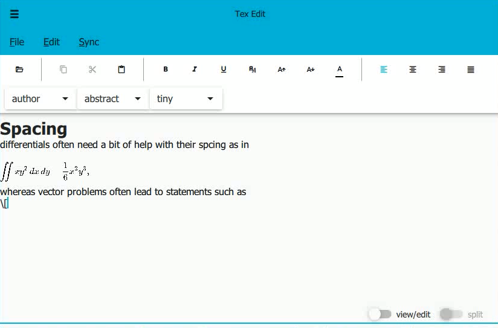

# Latex wysiwyg editor

## Intro

This program has three parts: client, sync server, node.js server(for math displaying).



### client

#### material design

Using qquick controls 2 material theme,  learn from the style in [google online doc editor](docs.google.com).

Also, the codes of editor and highlight are from example and markdownhighlighter on github, the ui is similar.(see: qquick controls 2 text editor).

#### code editing

use http to get mathjax result . A local server is provided. The server address can be modified to any address that hosts a mathjax-node server.

#### highlight

support tags:

```c++
 		NoState =-1,
        Default = 0,
        //special
        MaskedSyntax,
        CurrentLineBackgroundColor,
        BrokenLink,
        //none
        NonePersis,
        None,

        //title
        Title,
        Subtitle,
        Author,
        //section
        Part,
        Chapter,
        Section,
        Subsection,
        Subsubsection,
        Paragraph,
        Subparagraph,
        Abstract,
        AbstractBegin,
        //Align
        AlignCenter,
        AlignLeft,
        AlignRight,
        //font size
        tiny,
        scriptsize,
        footnotesize,
        small,
        normalsize,
        large,
        Large,
        LARGE,
        huge,
        HUGE,
        //font family
        Italic,
        Emph,
        Bold,
        Underline,
        Color,
        //special
        Link,
        Image,
        Comment,
        //Math
        MathInline,
        MathEq,
```

use highlighter to fontsize=0.0001 and other qtextformat to achieve result.

##### display mode

there are three modes: view, edit and split with three styles(in development)

#### sync

We deploy a system inspired by git.

So far, only the sync part is finished.

The user connect with peers by docId. On doc modification, client send full doc to server.

Then the server compute a patch on user's own latest update, then send the patch to other peers.

Then, peers apply the patch to its own doc, thus allow changes.


In development:

​	If user was offline, on connection, the patch of the latest commit to users latest update is sent to client. Then the user can decide whether to use the patch or create a new docId or commit its current doc.

​	The commit function is in development, currently any update with 5 minutes later will be a commit. The function in development is to commit on Ctrl-S or commit clicked.

  The update menu is to decide whether to auto update user doc.

  The convert menu is to convert to pdf and display in split view.

#### template

click docs in homepage,  it will load the tex template. 

#### in development

- tab displaying

  - new tab is finished, the tab name and session haven't been integrated to front end. 

- font size 

  - backend code finished

- more latex tags

- history

  - as shown at right in home
  - frontend finished

- pdf displaying

  - backend code finished

- real time update for pdf

  - backend code finished

- setting

  - frontend finished

- local pandoc and pdflatex support

  

#### errors

math display sequence error, to avoid this, multithreading is needed

currently only one thread, cause errors in positoning.

### mathjax-node

can handle get and post data.

### server

#### pdf

use pdflatex to convert, if error, the log will be converted to pdf via pandoc , then sent to client.

#### user

so far no password function.

In development, use salt to encrypt password and the raw will not be saved.

#### commit and update

```
    online edit:
        users overwrite their own branch to get patch
            patch then sent to all users online
                after 10 min, new branch is set, the master is auto saved
        the master commit is made when user save or commit it,
        if commited, origin is changed

    offline:
        check if last master origin equals matser commit
        user doc is patched with its last master origin on matser commit
        then show it and ask user's agreement
        choose another docid, modify the branch or commit

    branch mode:
        like online, the only difference is not syncronize
        the master branch is not auto committed too
```

#### protocol

```c++

/*
 *document changed if set server=> send message to compile
 *          if login=> save
 *          if splitview=> send pdf;
 *      if has cooperator=> set document bound
 *                  then push and patch
 *              commit system: branch, master
 *
 *	1: login{ req:"login",data:{user:"",password:""} }
 *  1-1: logout{req,data{userId}}
 *=>2: convert { req:"convert", data:{docId, doc:"",innerId}}//check user and time
 *	3: connect { req:"connect", data:{docId:""/null, userId:"",innerId}}
 *  3-1: disconnect { req:"disconnect, data:{userId,docId,user}"}<=delete user?doc?peer?
 *=>4: update { req:"update", data:{userid:"",docId:"", doc:""}}//check user and time
 *=>5: commit
 *
 * TODO get and compare branch
 * 2,4,5 together:
 *      { req:"document", data:{userId, docId, doc:"", update:bool, commit:bool, convert:bool}}
 *
 *
 *reply:
 *
 *TODO: remove cooperate user
 *=> 1: {res:"login",data:{state:[success==0|invalid|pass incorrect==2|new user==4],userId}}
    1-1: logout
 *both added to sql
 *TODO check ownership
 *  2: {res:"convert",data:{state[success==0|invalid|failed!=0],docId,innerid,result:{pdf/debug}}}
 *  3: {res:"connect",data:{state[success|invalid|notLogIn|docexisted|usernotconnected],//TODO why failed
 *                        userId, docId, innerId,users:[userID1,userID2....][who connected]}
 *  3-1: {res:"disconnect", state:[success|invalid|user|doc|peer],userId,docId,[users]}
 *=>4: {res:"update",state:[success|invalid|notLogIn|idNotExist|sentfailed],userId,docId}
 *=>5: commit {res,[success|invalid|notLogIn|idNotExist|conflict],user,doc}//TODO why conflict?
 *
 *
 *redirect:
 *  1: be connected{req:"rconnect",data:{userId:"",docId:"",userFrom}}
 *		rdisconnect: ask to disconnect
 *		rdisconnected: someone disconnected
 *		rlogout: ask to logout
 *  2: sent Doc: {req:"rupdate",data:{userId:"",docId:"",doc:""<=patch[,patch:""],time:""}}
 *  3: sent Commit: {req:"rcommit",
 *              data:{docId:""
 *					,doc:""[/patch:""]
 *					,time:""
 *					,userId:""}}
 *
 *
 */
```

#### sql

```c++
/*
 * user: user_id username password(salted) status login_id()
 * doc: doc_id user_id create_time update_time latest_id(version_id)
 * doclink: link_id doc_id user_id
 * login: login_id user_id login_time logout_time ip
 * alldoc: version_id doc doc_id user_id time commit(bool) latest(bool) locked(bool) origin(version_id)
 * connection: on_id user_id doc_id
 *	//TODO maybe in version 3, this table is omitted, to doclink "online" field
 */

```

#### in development

- disconnect other user

- other commit related functions

- multi files support for latex, currently only one tex file

  

## Installation

### server

`mysql` required.

enter password, username, port in `sqltex.cpp`

### client

set server in `main.cpp`

### mathjax-node

node.js is needed

run `npm install -s`

`npm run dev`